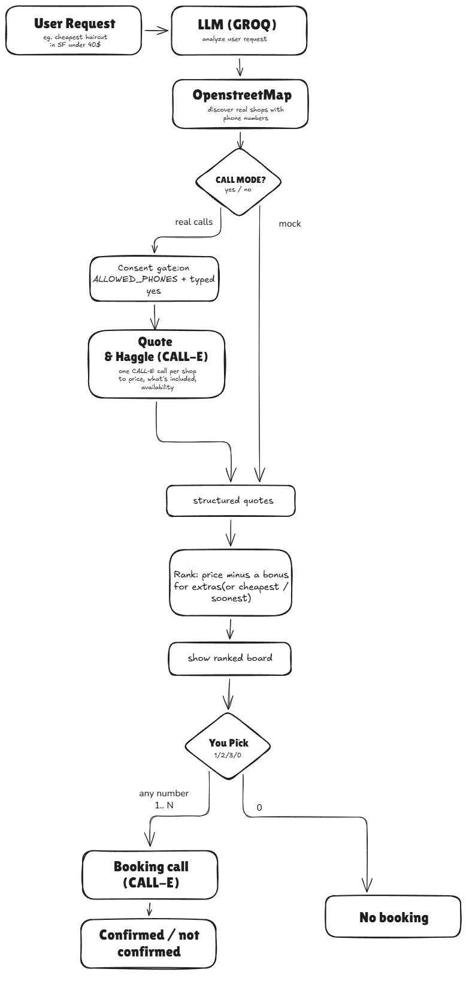

# Callsweep

**Don't call ten shops. Let Callsweep haggle them for you.**

Callsweep is an AI agent that calls local businesses for you. On each call it asks the price, then haggles the shop down toward your budget, and if they won't drop the price it asks what they can throw in instead. It then ranks the usable offers by price, with a bonus for any included extras (or by cheapest or soonest if you prefer), and books the one you pick. Built on CALL-E.

## Quickstart (mock mode, no calls)

```bash
bun install
bun run src/index.ts "cheapest haircut in San Francisco"
```

Mock mode is the default and needs **no API keys at all**. It simulates the shop responses, so you can see the whole flow without spending money or dialing anyone. A `GROQ_API_KEY` sharpens the plain-English parsing (there's a rule-based fallback without it), and discovery from OpenStreetMap uses no key. Keys are only needed for real calls (`MOCK=false`).

## Real calls

Set your keys in `.env` (copy `.env.example`):

```
CALLE_API_KEY=...   # from the CALL-E dashboard
GROQ_API_KEY=...    # from console.groq.com (free)
```

Real calls only dial numbers you explicitly authorize. Put the SAME valid E.164 number in both `ALLOWED_PHONES` (the authorized-recipient allowlist) and `TEST_PHONES`. Use your OWN number in place of the example below:

```bash
ALLOWED_PHONES="+14155550100" MOCK=false TEST_PHONES="+14155550100" bun run src/index.ts "cheapest haircut"
```

The app refuses to dial any number that is not strict E.164 and on `ALLOWED_PHONES`, then asks for a `yes` at the prompt before placing a call. To run against real discovered businesses, add each shop's number to `ALLOWED_PHONES` first: a number that is not on the allowlist is never dialed.

## Stack

| Layer | What's running |
|---|---|
| Runtime | Bun + TypeScript |
| Calls | CALL-E (`@call-e/calle`) |
| Understanding | Groq (`openai/gpt-oss-20b`) |
| Discovery | OpenStreetMap (Nominatim geocode + Overpass) |
| View | Live terminal board |

## How it works



```
you: "haircut under $40"
        |
   parse request + budget (Groq)
        |
   discover shops (OpenStreetMap)
        |
   ONE call per shop (CALL-E): ask price -> haggle toward budget
                               -> or get extras if they won't drop
        |
   rank by best deal (value / cheapest / soonest)
        |
   YOU pick which to book  ->  booking call (CALL-E)
```

Two of the steps are CALL-E phone calls: the quote-and-haggle call to each shop,
and the booking call to the shop you pick. Everything else is orchestration
around them. In mock mode those calls are simulated; with `MOCK=false` the same
pipeline places real calls. The final booking is never automatic, you choose it.

## Layout

```
src/
  index.ts       entry point; runs the pipeline and takes your booking pick
  intake.ts      Groq: request -> { category, location, priority, budget }
  discovery.ts   OpenStreetMap: geocode + find phone-listed businesses
  calle.ts       CALL-E wrapper + mock quotes; the quote-and-haggle call
  rank.ts        best-value / cheapest / soonest ranking
  book.ts        booking call for the shop you pick
  board.ts       live terminal view
  types.ts       Vendor, Quote
scripts/         dev tools: refresh vendor cache, single-call tests
fixtures/        sample and cached vendor data
```

## Environment

| Var | Meaning |
|---|---|
| `CALLE_API_KEY` | CALL-E API key |
| `GROQ_API_KEY` | Groq API key |
| `MOCK` | set to `false` to place real calls (default: mock) |
| `ALLOWED_PHONES` | comma-separated E.164 allowlist; only these numbers may be dialed |
| `TEST_PHONES` | comma-separated E.164 numbers to call instead of real shops (must also be on `ALLOWED_PHONES`) |
| `CUSTOMER_NAME` | name the booking is made under on the booking call (default `Alex Kim`) |
| `STEP_MS` | live-board reveal delay in ms (default 500) |

You can put a target price in the request itself (`"haircut under $40"`); if you
don't, the app asks for one before it calls. That budget is what each shop is
haggled toward.

## Status

Mock demo runs with no keys (sample shops, simulated responses). Real CALL-E calling, the two-step negotiation script, and structured extraction are tested live on my own authorized numbers, not against real businesses. Directory data (OpenStreetMap) is unverified discovery input; prices and availability come from the call or mock response, never the directory. Full end-to-end run: see the demo video.
